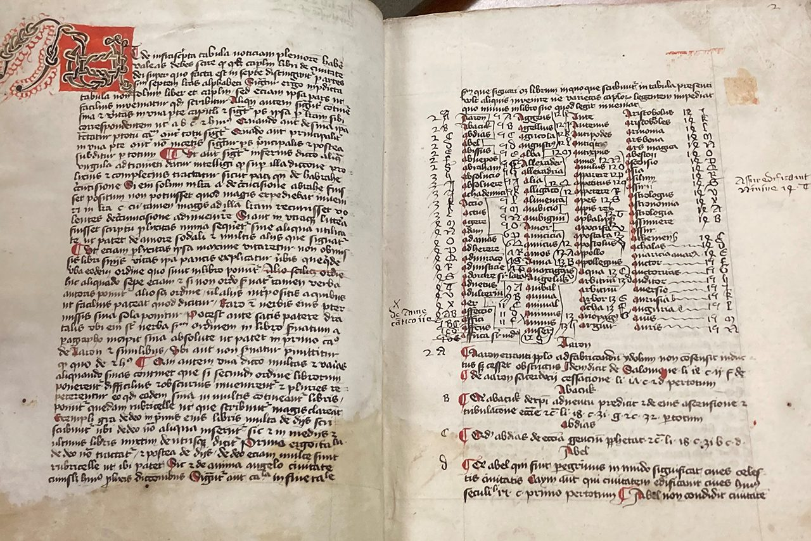
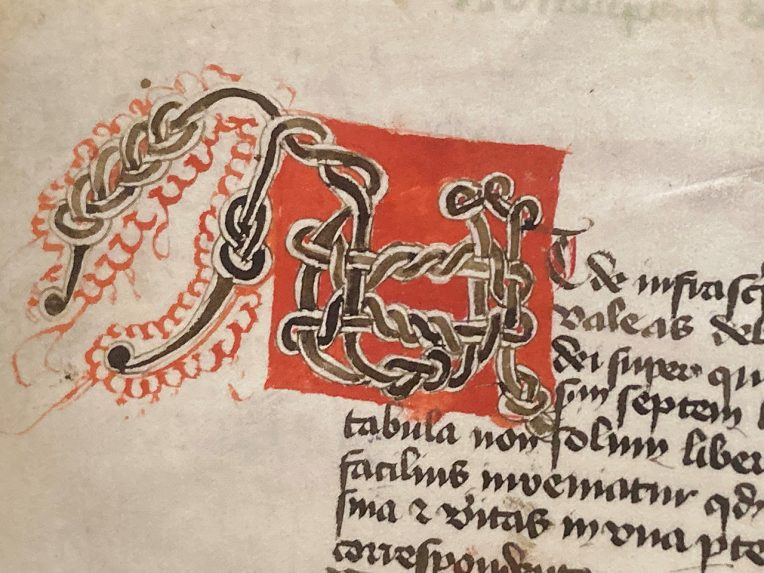
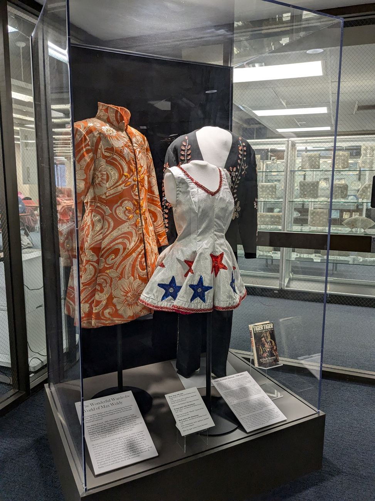
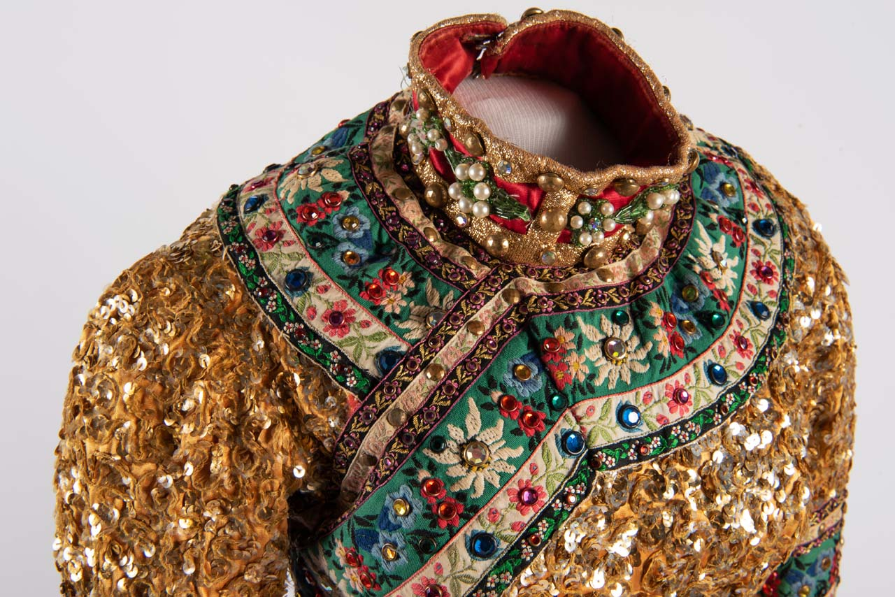
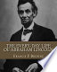
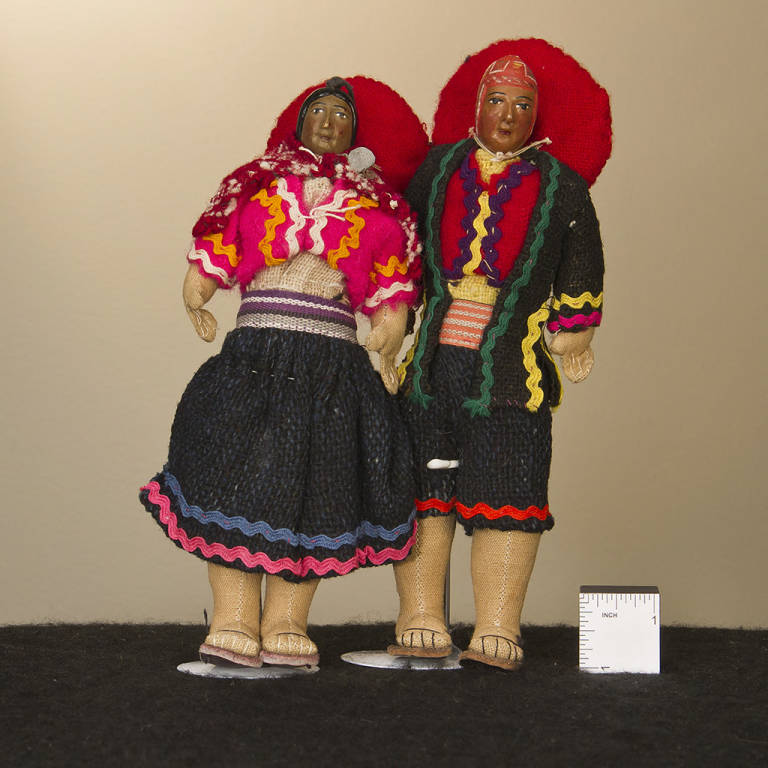
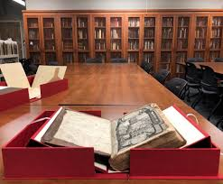

**bolded** words are vocabulary from units 1-4

_undelined_ words are cognates or words where you can figure out the meaning from context

# Colecciones Especiales de la Biblioteca Milner 

El departamento de _Colecciones Especiales_ de la **biblioteca** Milner alberga un archivo de materiales que incluye _objetos_, _diarios_, **libros** de recortes, _archivos_ institucionales y organizacionales, correspondencia, _fotografías_, _programas_ de mano, _manuscritos_ afiches y disfraces. 

Las _áreas_ _principales_ de colección son: 

left blank 

### 1. La Colección de Libros raros y finos 

En la sala **hay** **libros** sobre *(about)* casi todos los _temas_, primeras _ediciones_, _ediciones limitadas_ y _ediciones autografiadas_. Los libros de esta colección datan desde 1250 hasta el _presente_. **Hay** libros de encuadernación fina y libros de <ins>tipografía</ins> **interesante**. 

<figure>
    
         
    <figcaption><em>Tabula super libros de civitate Dei</em>. Manuscrito. Siglo XV. Foto: Becky Koch. Este manuscrito es un folio de hojas individuales de <u>papel</u>, encuadernadas como un <u>diario</u>. La pieza está escrita en <i>vellum</i>, un tipo <u>especial</u> de <u>piel</u> <u>preparada</u> de <u>animal</u> . Es <u>notable</u> el <u>estilo tipográfico</u> y los <u>colores vívidos</u>.</figcaption>
</figure>

### 2. La Colección de Circo y Artes Aliadas

La colección de _Circo_ y Artes Aliadas es una de las colecciónes más _grandes_ de su tipo. La colección se enfoca en el _circo_ y otras _artes_ relacionadas como _carnavales_ y desfiles.
Adicionalmente a 8000 libros, en esta colección **hay** _fotografías_, afiches de _circo_, _programas_ de mano del **_Circo_ Gamma Phi**, _libros_ de ruta, _correspondencia_, _documentos_ y partituras de _música_ para _banda_.
En la Colección de Circo también **hay** más de 1000 piezas _textiles_ pertenecientes a la Colección Ueckert de Guardaropa del Circo con piezas desde 1889 hasta los años 1980s. **Hay** _ropa_, _sombreros_, silbatos, _botas_, _capas_ y _uniformes_, entre otros. Algunas de estas piezas se exhiben sobre _maniquíes_ _especiales_ en las escaleras del _tercer_ _piso_ de la biblioteca Milner.

<figure>
    
    
    <figcaption>Exhibición de uniformes, biblioteca Milner. Foto: Becky Koch. </figcaption>
</figure>

### 3. La Colección de H.K. Sage

Esta colección incluye libros sobre (*about*) Abraham Lincoln y fue donada por Harold K. Sage a la **biblioteca** Milner en 1979.

Harold K. Sage (1890-1984) fue originario de Normal, su **residencia** estaba **cerca** a la **residencia** de Jesse W. Fell, **amigo** _cercano_ de Lincoln y _fundador_ de la **Universidad Estatal de Illinois**. 
H.K. Sage comenzó a adquirir libros sobre (*about*) Lincoln en el **invierno** de 1918, la colección creció hasta contener 2600 **libros** y _panfletos_ que abarcan todos los aspectos de la vida de Lincoln.

<figure>
    
    <figcaption><em>La vida diaria de Abraham Lincoln</em> por Francis Fisher. 1913. Colección Lincoln de H.K. Sage.
    </figcaption>
</figure>

### 4. La colección de literatura para niños y de libros de texto históricos.

En las Colecciones Especiales también hay colecciones de _literatura_ para niños.
En la colección de Lois Lenski hay libros _publicados_, _manuscritos_, _muñecos_, _ilustraciones_ _originales_ y _notas_ de investigación.
En la colección de Will Johnson hay **libros** del siglo XIX y XX sobre (*about*) una gran variedad de temas.

<figure>
    
    <figcaption>Pareja de <b>muñecos</b> <u>peruanos</u> de la colección de Lois Lenski. Tienen cuerpos de tela rellenos y cabezas de madera talladas y pintadas. Las cabezas están sujetas con una cuerda a través de sus <b>sombreros</b>. Llevan sandalias de cuero. La <b>muñeca</b> lleva una falda negra y una chaqueta rosa con cintas <u>multicolores</u>. El <b>muñeco</b> lleva <u>pantalones</u> negros, una <u>chaqueta</u> negra y una camisa roja, todos con cintas <u>multicolores</u>.</figcaption>
</figure>

## _Visitar_ la sala de Colecciones Especiales de la biblioteca Milner
La sala de _Colecciones Especiales_ está en el _sexto piso_ de la biblioteca Milner. La sala está abierta de **lunes** a **jueves** de **nueve** de la **mañana** hasta el **mediodía** y de la **una** de la **tarde** hasta las **cuatro** de la **tarde**, y el **viernes** de **nueve** de la **mañana** hasta el **mediodía**. Los **fines de semana** la sala no **tiene** _atención_ al _público_. 

Para _visitar_ la sala de colecciones especiales, **tienes que** programar una cita. **Tienes que** contactar a los encargados por correo `milnerspc@IllinoisState.edu` o llamar por teléfono al `(309) 438-2871`.

### Reglas de uso de la sala
- Todas las mochilas 🎒 tienen que almacenarse en la entrada de la sala ⚠️.
- Las fotografías digitales están permitidas 📷 ✅.
- Está permitido fotocopiar algunos artículos ✅.
- Tienes que usar un lápiz ✏️ o tu computadora para tomar notas ✅. Los bolígrafos 🖋️ no están permitidos ❌ .

### Handout - Lección sobre Las Colecciones Especiales

In this lesson you will learn about some of the items you may find in Special Collections at Milner's library.

#### Warm-up
Encierra en un _cícrulo_ ⭕️ la respuesta correcta.

1. ¿En qué _piso_ está la sala de Colecciones Especiales de la biblioteca Milner?
			
		1 	2 	3 	4 	5	6
2. 🗓️ Los **días de la semana** en que la sala tiene _atención al público_

		Lunes Martes Miércoles Jueves Viernes Sábado Domingo

3. Encierra en un círculo todas las horas de atención de el día **viernes** (circle all that apply)

		9-10a.m. 	10-11a.m.	11a.m.-12p.m. 	12p.m.-1p.m.
		1-2p.m.		2-3p.m. 	3-4p.m.
4. Encierra en un círculo los artículos **no permitidos** en la sala

		lápiz 	computadora	 bolígrafo	 mochila	 cámara

##### PASO 1
_(On your own)_
Compara varias parejas de los ítems mostrados en la pantalla:

###### MODELO
El **circo** **es** _colorido_, el **sombrero** no **es** _colorido_

*(Use other adjectives that make sense for your comparisons)*

1.

2.

3.

4.

##### PASO 1
Responde estas preguntas sobre tu colección particular. Usa el MODELO.
###### MODELO
**¿Cómo se llama tu Colección?**

- Mi colección **se llama** *"Archivo de Hamilton en la biblioteca _pública_ de Nueva York"* *(the title of your sheet)*

**¿Qué hay en tu colección?**

- En mi colección **hay** _correspondencia_ y un _retrato_ *(a portrait)* de Alexander Hamilton.
	
	
**¿Por qué *(why)* es interesante tu colección?** (ser/estar/haber)

- Porque *(because)* **hay** retratos de varias personas como Aaron Burr, Alexander Hamilton

- Porque el retrato **es** viejo

- Porque **hay** documentos _históricos_

**List some vocabulary you understood from congates, from context or from the pictures**

1. retrato: portrait
2. correspondencia: correspondence
3.  histórico: historic
4. archivo: archive
5. pública: public

##### PASO 3
Forma un grupo de personas, en grupo **tiene que** haber los números 1,2,3,4 sin repetición. 

*(Form a group, in Spanish, numbers in the group must be different from each other)*
###### MODELO
	A: ¿Cuál es tu número?

	B: tres, ¿Y tú?

	A: tres

	B: ¡Adiós!

*(You have the same number, you separate and look for another group to join)*

##### PASO 4
Pregunta a los otros por sus colecciones y toma notas

**¿Cómo se llama tu Colección?**

**¿Qué hay en tu colección?**
	
**¿Qué es interesante de tu colección?** 

##### PASO 5

¿Quién es el impostor? ¿Por qué?

		El libro raro y antiguo
		
		El Sombrero
		
		El musical Hamilton
		
		El circo Gamma Phi
		
		Los muñecos peruanos

Reach an agreement in Spanish. Draw an impostor  figure next to the impostor. 

## Handout - Lección sobre Las Colecciones Especiales

In this lesson you will learn about some of the items you may find in Special Collections at Milner's.

### ¿Cómo te llamas? _____________________________

#### Warm-up
Encierra en un _cícrulo_ ⭕️ la respuesta correcta.

1. ¿En qué _piso_ está la sala de Colecciones Especiales de la biblioteca Milner?
			
		1 	2 	3 	4 	5	6
2. 🗓️ Los **días de la semana** en que la sala tiene _atención al público_

		Lunes Martes Miércoles Jueves Viernes Sábado Domingo

3. Encierra en un círculo todas las horas de atención de el día **viernes** (circle all that apply)

		9-10a.m. 	10-11a.m.	11a.m.-12p.m. 	12p.m.-1p.m.
		1-2p.m.		2-3p.m. 	3-4p.m.
4. Encierra en un círculo los objetos **no permitidos** en la sala

		lápiz 	computadora	 bolígrafo	 mochila	 cámara

##### PASO 1
Responde estas preguntas sobre tu colección particular. Usa el MODELO.

**¿Cómo se llama tu Colección?**

.

**¿Qué hay en tu colección?**

.

	
	
**¿Por qué *(why)* es interesante tu colección?** (ser/estar/haber)

.

.

**List some vocabulary you understood from congates, from context or from the pictures**

1. 
2. 
3. 
4. 
5. 

##### PASO 3
Forma un grupo de personas, en grupo **tiene que** haber los números 1,2,3,4 sin repetición. 

##### PASO 4
Pregunta a los otros por sus colecciones y _toma notas_ *(take notes from each other, don't share the sheet, there is no need for complete sentences here)*

**¿Cómo se llama tu Colección?**

**¿Qué hay en tu colección?**
	
**¿Qué es interesante de tu colección?** 

.

.

.

.

.

.

##### PASO 5

¿Quién es el impostor? 
         
         
###### MODELO
El impostor es ________________________

		El libro raro y antiguo
		
		El Sombrero
		
		El musical Hamilton
		
		El circo Gamma Phi
		
		Los muñecos peruanos

Reach an agreement in Spanish. You may share your reading now. Draw an impostor figure  next to the impostor. 

